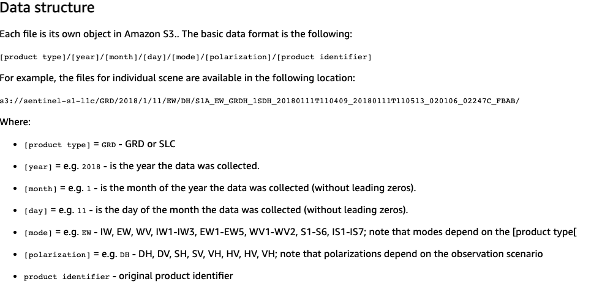
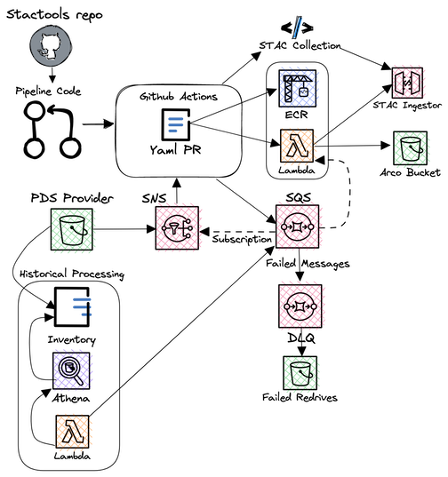
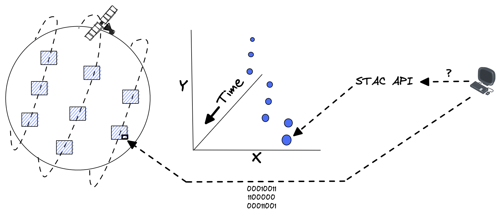
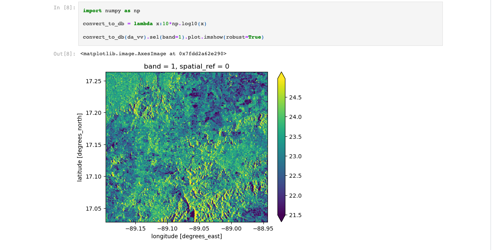

---
## Improving The ASDI Experience

---
ASDI's organic, decentralized approach has worked great in several aspects.

- Minimal gatekeeping lowers the barrier of entry for data providers.<!-- .element: class="fragment" -->
- Gives large federal data providers like NOAA a space for experimentation.<!-- .element: class="fragment" -->
- As intended, it has truly democratized access to planetary scale data.<!-- .element: class="fragment" -->

---
But the same aspects that make it successful also reduce its effectiveness and adoption by users

- Limited centralized oversight leads to a lack of focus on important thematic areas.<!-- .element: class="fragment" -->
- Lack of standardization reduces data interoperability for data users.<!-- .element: class="fragment" -->
- The lack of a centralized indexing and search inteface makes data discovery and fusion impossible for data users.<!-- .element: class="fragment" -->
---
### Let's look at a concrete example.

I'm a user who needs needs SAR data to do deforestation detection in a tropical region that is obscured by clouds.
---

---
Today I'd need to first search through the Registry of Open Data on AWS.

Then (if there was documentation) understand the underlying file structure the dataset uses.
---

---
Then finally, I can manually comb through and assemble the list of files for my area and time of interest.
---
What if I want to correlate some of my findings with other optical data?

I'd need to repeat this investigation process for every dataset I work with.
---
### How can we improve this ASDI experience for the user community?
---
### Adopt a common metadata standard.
---

---
STAC is a community driven standard for spatiotemporal metadata and APIs.

Rather than originitating with a standards body like OGC, STAC evolved from industry and community members who had immediate, common problems to solve.
---

---
<!-- .slide: data-background-color="white" -->

---
Development Seed has been involved with STAC since its inception.

We've built both the main reference implementations of the API standard as well as a suite of tooling for working with the metadata specification.
---
The bulk of our projects are built on the STAC specification and a common set of open source libraries we build and maintain.
---

<!-- .slide: data-background-color="white" -->
Most relevant to this project is our work building the API infrastructure for Microsoft's Planetary Computer

---
The Planetary Computer obviously runs on Azure.

But the bulk of the NASA projects we build use STAC and the same suite of libraries deployed on AWS.
---
<!-- .slide: data-background-color="white" -->

---
When used together we call this suite of libraries eoAPI.

It serves 3 main purposes
- Store metadata for data files in a durable database.
- Serve this metadata in a standard, searchable API that a wide variety of clients can utilize.
- Provide a standard API that allows dynamically visualizing data files for analysis. 
---
The eoAPI suite is built from 3 libraries
- pgSTAC: An optimized Postgres schema to index and search large scale STAC collections
- stac-fastapi: An STAC API spec compliant FastAPI application for metadata search
- titiler-pgstac: a TiTiler extension for pgSTAC for large scale dynamic rendering of STAC data
---
### How have we realized this vision for ASDI?
---
### Step 1 - Infrastructure
---
### [cdk-pgstac](https://github.com/developmentseed/cdk-pgstac)

To provide an easy developer entrypoint and capture best practices we built a reusable CDK construct to package all of the eoAPI infrastructure into a single AWS deployment.

---
Now we have a central API where data providers can publish standard metadata for all of the datasets they manage.
---
### Step 2 - Enable Data Providers

- Give them easy tools to turn their domain specific knowledge into pipelines for creating cloud-native formats and metadata.
- Run these pipelines automatically at scale.
---
### [Stactools](https://github.com/stactools-packages)

The community has been capturing product format specific information and transformations in a set of standard packages called stactools.
---
### [ASDI Pipelines](https://github.com/developmentseed/aws-asdi-pipelines)
- Data providers and the community build a stactools package for their dataset (in many cases these already exist from our work on Planetary Computer).
- Data providers use common AWS configurations on the buckets they manage (SNS Topics and Inventories).
- Using these, data providers can create pipelines which will automatically deploy infrastructure that monitors the SNS topic (and parses the inventory) to create cloud-native formats and metadata and ingest them into the API. 
---
<!-- .slide: data-background-color="white" -->

---
As part of this initial investigation work we 
- Built and updated stactools packages for several ASDI datasets.
- Deployed pipelines in our test account which are continously running with new streaming data.
---
There is a strong distinction between 2 types of spatiotemporal data that are in ASDI.

### Sparse

### Gridded N-Dimensional
---
### Sparse
<!-- .slide: data-background-color="white" -->

---
### Gridded N-Dimensional
<!-- .slide: data-background-color="white" -->

---
Users interact with these different types of data in different ways.

Using different tools.

---
<!-- .slide: data-background-color="white" -->
Xarray being the most popular.

---
But a million NetCDF files stored in a bucket don't provide a friendly data access interface.
---
We need a centralized index of all the raw data in these netCDF files. 

So that xarray can easily read only the bytes of interest.

To create this index we use Pangeo Forge
---

---
Pangeo Forge is a community-driven platform for generating analysis-ready, cloud-optimized ARCO data stores from legacy data provider archives.

Using its Kerchunk functionality we can generate a central index for millions of NetCDF files making them easily accessible in modern applications without any storage duplication.
---
Though the technology is excellent, the most valuable part of Pangeo Forge is the large community with domain specific knowledge who can build and contribute recipes to make ASDI datasets more usable and accessible.
---
Through investigation and feedback from community members on Pangeo Forge Github issues, we've already identifed data quality issues with 4 datasets managed by NOAA Open Dataset Dissemnitation (NODD) and communicated the issues back to them.
---
## So have cloud-optimized data and metadata.  What do we do with it?
---
<!-- .slide: data-background-color="white" -->
We built out a repository called [asdi-examples](https://github.com/developmentseed/asdi-examples/tree/main) with Jupyter notebooks targeting SageMaker that demonstrate STAC API and COG usage.

---
### So we've built out the technology foundation to make ASDI data more valuable for the user community.

## What's next???
---
